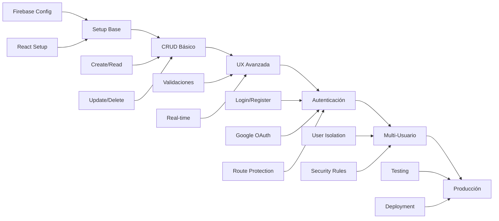

# 📚 Guía Completa - Firebase Task Manager


> **Curso práctico completo** para crear un gestor de tareas profesional usando **React 18**, **Firebase** y **Tailwind CSS**

---

## 🎯 **Descripción del curso**

Este curso te enseña a construir desde cero una **aplicación web moderna y completa** de gestión de tareas, implementando las mejores prácticas de desarrollo frontend y backend. A lo largo de 15 sesiones progresivas, crearás un sistema robusto con autenticación, CRUD operations, multi-usuarios y deployment en producción.

### **🚀 Lo que vas a construir:**
- ✅ **Aplicación SPA** con React 18 y Vite
- ✅ **Sistema de autenticación** completo (email/password + Google OAuth)
- ✅ **CRUD de tareas** con validaciones y tiempo real
- ✅ **Multi-usuario** con aislamiento total de datos
- ✅ **Dashboard personalizado** con estadísticas
- ✅ **Deployment en producción** con Firebase Hosting

---

## 📖 **Índice completo del curso**

### **🏗️ BLOQUE 1: Fundamentos y setup (Sesiones 64-68)**
> Establecer base técnica sólida y configuración del proyecto

| Sesión | Título | Duración | Conceptos clave |
|--------|--------|----------|-----------------|
| **[64](./sesiones/sesion-64.md)** | 🔥 Introducción a backend y Firebase | 90 min | Backend vs Frontend, Firebase Console, Firestore setup |
| **[65](./sesiones/sesion-65.md)** | 📊 Conexión con Firestore | 75 min | SDK Firebase, configuración React, primera conexión |
| **[66](./sesiones/sesion-66.md)** | ✅ Operaciones CREATE y READ | 90 min | addDoc, getDocs, colecciones, documentos |
| **[67](./sesiones/sesion-67.md)** | 📝 Operaciones UPDATE y DELETE | 75 min | updateDoc, deleteDoc, referencias, timestamps |
| **[68](./sesiones/sesion-68.md)** | 🎨 Arquitectura de servicios y hooks | 90 min | Separación de responsabilidades, custom hooks, patterns |

### **🛠️ BLOQUE 2: CRUD avanzado y UX (Sesiones 69-71)**
> Completar funcionalidades y mejorar experiencia de usuario

| Sesión | Título | Duración | Conceptos clave |
|--------|--------|----------|-----------------|
| **[69](./sesiones/sesion-69.md)** | 🔍 Validación y manejo de errores | 75 min | Validación cliente/servidor, error boundaries, feedback |
| **[70](./sesiones/sesion-70.md)** | ⚡ Funcionalidades avanzadas | 90 min | Filtros, búsqueda, ordenamiento, operaciones bulk |
| **[71](./sesiones/sesion-71.md)** | 💡 Optimización y tiempo real | 75 min | Listeners en tiempo real, performance, caching |

### **🔐 BLOQUE 3: Autenticación completa (Sesiones 73-77)**
> Sistema de usuarios robusto y seguro

| Sesión | Título | Duración | Conceptos clave |
|--------|--------|----------|-----------------|
| **[73](./sesiones/sesion-73.md)** | 🔐 Introducción a Firebase Authentication | 90 min | Auth concepts, setup, contextos de autenticación |
| **[74](./sesiones/sesion-74.md)** | 📱 Componentes de Login y Registro | 90 min | Formularios, validación, UX de autenticación |
| **[75](./sesiones/sesion-75.md)** | 🌐 Integración con Google OAuth | 75 min | OAuth setup, providers, account linking |
| **[76](./sesiones/sesion-76.md)** | 🛡️ Protección de rutas y componentes | 90 min | Route guards, protected routes, navigation |
| **[77](./sesiones/sesion-77.md)** | 👥 Conectar tareas con usuarios | 90 min | Multi-usuario, data isolation, security rules |

### **🚀 BLOQUE 4: Finalización y deployment (Sesión 78)**
> Testing, optimización y puesta en producción

| Sesión | Título | Duración | Conceptos clave |
|--------|--------|----------|-----------------|
| **[78](./sesiones/sesion-78.md)** | 🎯 Finalización, Testing y Deployment | 120 min | Testing suite, production build, Firebase Hosting |

---

## 🛠️ **Stack tecnológico completo**

### **🎨 Frontend**
- ⚛️ **React 18** → Hooks, Suspense, Concurrent features
- ⚡ **Vite** → Build tool ultra-rápido con HMR
- 🎨 **Tailwind CSS** → Utility-first styling
- 📱 **Responsive Design** → Mobile-first approach
- ♿ **Accessibility** → ARIA, semantic HTML, keyboard navigation

### **🔥 Backend/Services**
- 🔥 **Firebase Auth** → Authentication multi-provider
- 📊 **Firestore** → NoSQL database real-time
- 🛡️ **Security Rules** → Validación y autorización server-side
- 🌍 **Firebase Hosting** → Static site hosting con CDN
- 📈 **Firebase Analytics** → Usage tracking y métricas

### **🔧 Herramientas de desarrollo**
- 📦 **NPM/Yarn** → Gestión de dependencias
- 🔍 **ESLint** → Linting y code quality
- 🎯 **Git** → Control de versiones
- 🚀 **Firebase CLI** → Deployment y gestión
- 🧪 **Manual Testing Suite** → Validación integral

---

## 📊 **Progresión de aprendizaje**



---

## 🎯 **Objetivos de aprendizaje**

### **Al completar este curso serás capaz de:**

#### **🏗️ Arquitectura moderna**
- Diseñar arquitecturas escalables cliente-servidor
- Implementar patrones de separación de responsabilidades
- Gestionar estado global con Context API y hooks
- Estructurar proyectos React de forma profesional

#### **🔥 Firebase expertise**
- Configurar y gestionar proyectos Firebase
- Implementar Firestore con queries complejas
- Diseñar Security Rules robustas
- Integrar Authentication multi-proveedor
- Desplegar aplicaciones en Firebase Hosting

#### **⚛️ React avanzado**
- Usar hooks personalizados efectivamente
- Manejar efectos secundarios y asincronía
- Implementar error boundaries y loading states
- Crear componentes reutilizables y accesibles
- Optimizar rendimiento y experiencia de usuario

#### **🛡️ Seguridad web**
- Validar datos en cliente y servidor
- Implementar autenticación y autorización
- Proteger contra vulnerabilidades comunes
- Gestionar sesiones y tokens de forma segura
- Aislar datos entre usuarios

#### **🚀 Desarrollo profesional**
- Configurar entornos de desarrollo modernos
- Implementar pipelines de build y deployment
- Realizar testing manual sistemático
- Documentar proyectos profesionalmente
- Seguir mejores prácticas de la industria

---

## 💼 **Casos de uso reales**

Esta aplicación sirve como **base sólida** para proyectos como:

- 📋 **Sistemas de gestión** (CRM, ERP básicos)
- 👥 **Plataformas colaborativas** (equipos, proyectos)
- 📱 **Aplicaciones SaaS** (multi-tenant)
- 🎓 **Portales educativos** (estudiantes, cursos)
- 🏢 **Dashboards empresariales** (métricas, reporting)
- 🛒 **E-commerce básico** (productos, órdenes)

---

## 📋 **Prerrequisitos**

### **✅ Conocimientos previos**
- **JavaScript ES6+**: Funciones flecha, destructuring, async/await
- **React básico**: Componentes, props, estado con useState
- **HTML/CSS**: Estructura semántica y estilos básicos
- **Git básico**: Clone, commit, push, pull
- **Terminal/CLI**: Navegación y comandos básicos

### **🛠️ Software necesario**
- **Node.js 18+** ([Descargar](https://nodejs.org/))
- **NPM o Yarn** (incluido con Node.js)
- **Git** ([Descargar](https://git-scm.com/))
- **Editor de código** (VS Code recomendado)
- **Navegador moderno** (Chrome, Firefox, Safari)

### **📱 Cuentas requeridas**
- **Cuenta Google** (para Firebase Console)
- **Cuenta GitHub** (opcional, para deployment)

---

## 🚀 **Inicio rápido**

### **1. Clonar el proyecto base**
```bash
git clone https://github.com/tu-usuario/firebase-task-manager.git
cd firebase-task-manager
npm install
```

### **2. Configurar Firebase**
1. Ir a [Firebase Console](https://console.firebase.google.com)
2. Crear nuevo proyecto
3. Habilitar Firestore Database
4. Habilitar Authentication (Email/Password y Google)
5. Copiar config a `src/services/firebase.js`

### **3. Ejecutar en desarrollo**
```bash
npm run dev
# Abrir http://localhost:3000
```

### **4. Seguir las sesiones**
Comenzar con [Sesión 64](./sesiones/sesion-64.md) y avanzar secuencialmente.

---

## 📁 **Estructura final del proyecto**

```
firebase-task-manager/
├── 📁 public/              # Assets estáticos
├── 📁 src/
│   ├── 📁 components/      # Componentes React
│   │   ├── 📁 auth/        # Login, Register, AuthPage
│   │   ├── 📁 tasks/       # TaskList, TaskItem, TaskForm
│   │   ├── 📁 ui/          # Button, Input, Modal, Spinner
│   │   └── 📄 Layout.jsx   # Layout principal con navegación
│   ├── 📁 hooks/           # Hooks personalizados
│   │   ├── 📄 useAuth.js   # Estado global de autenticación
│   │   └── 📄 useTasks.js  # Estado global de tareas
│   ├── 📁 pages/           # Páginas principales
│   │   ├── 📄 AuthPage.jsx # Página de login/registro
│   │   └── 📄 TasksPage.jsx# Dashboard principal
│   ├── 📁 services/        # Servicios de Firebase
│   │   ├── 📄 firebase.js  # Configuración Firebase
│   │   ├── 📄 authService.js # Operaciones de autenticación
│   │   └── 📄 taskService.js # CRUD de tareas
│   ├── 📁 utils/           # Utilidades y helpers
│   │   ├── 📄 validation.js # Validaciones de datos
│   │   └── 📄 dateUtils.js # Formateo de fechas
│   ├── 📄 App.jsx          # Componente raíz
│   ├── 📄 main.jsx         # Punto de entrada
│   └── 📄 index.css        # Estilos globales (Tailwind)
├── 📁 docs/                # Documentación del curso
│   ├── 📁 sesiones/        # Sesiones individuales (64-78)
│   ├── 📄 GUIA.md          # Esta guía principal
│   └── 📄 SETUP.md         # Instrucciones de configuración
├── 📄 package.json         # Dependencias y scripts
├── 📄 vite.config.js       # Configuración de Vite
├── 📄 tailwind.config.js   # Configuración de Tailwind
├── 📄 firebase.json        # Configuración de Firebase
├── 📄 firestore.rules      # Security Rules de Firestore
└── 📄 README.md            # Información del proyecto
```

---

## 🧪 **Metodología de enseñanza**

### **📚 Enfoque práctico**
- **80% hands-on coding** - Escribir código real desde la primera sesión
- **20% conceptos teóricos** - Solo la teoría esencial para entender el "por qué"
- **Construcción incremental** - Cada sesión agrega funcionalidad al proyecto
- **Refactoring continuo** - Mejorar código constantemente

### **🎯 Validación constante**
- **Checkpoints en cada sesión** - Verificar que todo funciona antes de continuar
- **Testing manual sistemático** - Probar cada funcionalidad implementada
- **Screenshots de verificación** - Capturar evidencia visual del progreso
- **Troubleshooting integrado** - Solucionar problemas comunes

### **🔄 Iteración y mejora**
- **Versiones incrementales** - El proyecto evoluciona gradualmente
- **Best practices desde el inicio** - Enseñar la forma correcta inmediatamente
- **Code review integrado** - Revisar y mejorar código en cada sesión
- **Documentación continua** - Documentar decisiones y patrones

---

## 🏆 **Certificación y portfolio**

### **🎓 Al completar el curso tendrás:**
- ✅ **Aplicación funcional en producción** - Portfolio piece demostrable
- ✅ **Código fuente completo** - GitHub repository profesional
- ✅ **Documentación técnica** - README y documentación de API
- ✅ **Conocimiento aplicable** - Skills transferibles a otros proyectos
- ✅ **Experiencia con stack moderno** - React + Firebase + Tailwind

### **💼 Proyectos derivados que puedes construir:**
- 🏪 **E-commerce** - Productos, carritos, órdenes
- 👥 **Red social** - Posts, comentarios, likes
- 📚 **LMS** - Cursos, estudiantes, progreso
- 💰 **Fintech** - Transacciones, balances, reportes
- 🏥 **Healthcare** - Pacientes, citas, historiales

---

## 🤝 **Soporte y comunidad**

### **📞 Canales de ayuda:**
- 💬 **Discord del curso** - Chat en tiempo real con estudiantes
- 📧 **Email directo** - Preguntas específicas al instructor
- 📱 **GitHub Issues** - Reportar bugs o solicitar features
- 📚 **FAQ extendido** - Respuestas a preguntas frecuentes

### **🎉 Comunidad activa:**
- 👥 **Study groups** - Grupos de estudio peer-to-peer
- 🚀 **Show & tell** - Compartir proyectos y variaciones
- 💡 **Feature requests** - Sugerir mejoras al curso
- 🏆 **Success stories** - Celebrar logros y proyectos finalizados

---

## 📈 **Roadmap futuro**

### **🔜 Próximas actualizaciones:**
- 🧪 **Testing automatizado** - Unit tests con Jest y React Testing Library
- 📱 **PWA capabilities** - Service workers y offline functionality
- 🎨 **Theming avanzado** - Dark mode y customización
- 🌐 **Internacionalización** - Multi-idioma con i18next
- 📊 **Analytics avanzadas** - Dashboards y métricas detalladas

### **🚀 Cursos relacionados:**
- **React Native** - Convertir a app móvil
- **Next.js** - SSR y generación estática
- **Node.js + Express** - Backend custom
- **TypeScript** - Tipado estático
- **AWS/Vercel** - Deployment alternativo

---

## 📜 **Licencia y uso**

Este curso y código están bajo **licencia MIT**:

- ✅ **Uso comercial permitido** - Usar en proyectos pagados
- ✅ **Modificación libre** - Adaptar según necesidades
- ✅ **Distribución permitida** - Compartir con otros
- ✅ **Uso privado** - Para proyectos personales
- ❌ **Sin garantías** - Uso bajo tu propia responsabilidad

---

## 🙏 **Agradecimientos**

### **🛠️ Tecnologías y herramientas:**
- [React](https://reactjs.org/) - La librería de UI que hace posible todo
- [Firebase](https://firebase.google.com/) - Backend as a Service excepcional
- [Tailwind CSS](https://tailwindcss.com/) - Framework de CSS utility-first
- [Vite](https://vitejs.dev/) - Build tool ultra-rápido
- [Lucide React](https://lucide.dev/) - Iconos hermosos y consistentes

### **👨‍💻 Comunidad:**
- **Estudiantes beta** - Por el feedback valioso
- **Contribuidores** - Por mejoras y correcciones
- **React community** - Por inspiración y mejores prácticas
- **Firebase team** - Por una plataforma increíble

---

<div align="center">

## 🚀 **¡Comienza tu viaje ahora!**

**👉 [Ir a la Sesión 64 - Introducción a Firebase](./sesiones/sesion-64.md)**

---

### 🔥 **Hecho con ❤️ usando React + Firebase + Tailwind CSS**


**⭐ Si este curso te ayuda, ¡dale una estrella al repositorio!**

</div>
